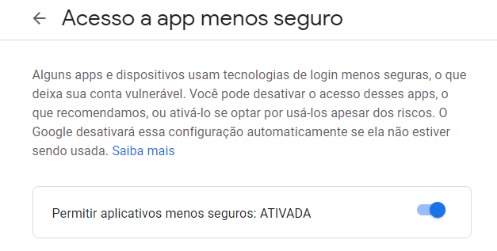

# crawler-instituto-identificacao-al

Projeto para monitorar vagas disponíveis no site de agendamento do Instituto de Identificação de Alagoas.

Basicamente há um job que acessa o site de agendamentos procurando por um determinado local, ao encontrar, dispara um
email notificando sobre a disponibilidade para novos agendamentos.


## Configurações

As configurações estão disponíveis no arquivo [application.yml](src/main/resources/application.yml)

* `app.crawler.job.delay` Intervalo entre as execuções do job (em milissegundos).

        valor padrão: 60000 (1 minuto).

* `app.crawler.job.initial-delay` Intervalo para primeira execução do job, assim que a aplicação for iniciada (em
  milissegundos).

        valor padrão: 5000 (5 segundos).

* `app.crawler.url` Url alvo das buscas

        valor padrão: https://idseg.institutodeidentificacao.al.gov.br/Vsoft.iDSPS.Agendamento/Agendamento

* `app.vacancy.place` Local utilizado nas buscas

        valor presente na primeira coluna do site

### Notificação por email

#### Servidor de email

Antes de utilizar o serviço é preciso configurar o servidor de email, por padrão está configurado para utilizar o GMail.

```yaml
spring:
  mail:
    host: smtp.gmail.com
    port: 587
    username:
    password:
    properties:
      mail.smtp.auth: true
      mail.smtp.starttls.enable: true
```

Configure as variáveis `spring.mail.username` e `spring.mail.password` com o email e senha que será utilizado como
remetente das notificações.

**É provável que você precise configurar o acesso de app menos seguro do GMail https://myaccount.google.com/lesssecureapps**




#### Emails para recebimento das notificações

```yaml
app:
  notification:
    to:
      - primeiro@email.com
      - segundo@email.com
```

#Docker

### Criação da imagem

Para criar a imagem execute o comando:

```
mvn clean package
```

Para rodar a aplicação execute o comando:

```
docker run -d 
        -e app.vacancy.place='União dos Palmares' 
        -e app.notification.to='seu-email@gmail.com' 
        -e spring.mail.username='seu-email@gmail.com' 
        -e spring.mail.password='***********' 
    crawler-instituto-identificacao-al:0.0.2-SNAPSHOT
```